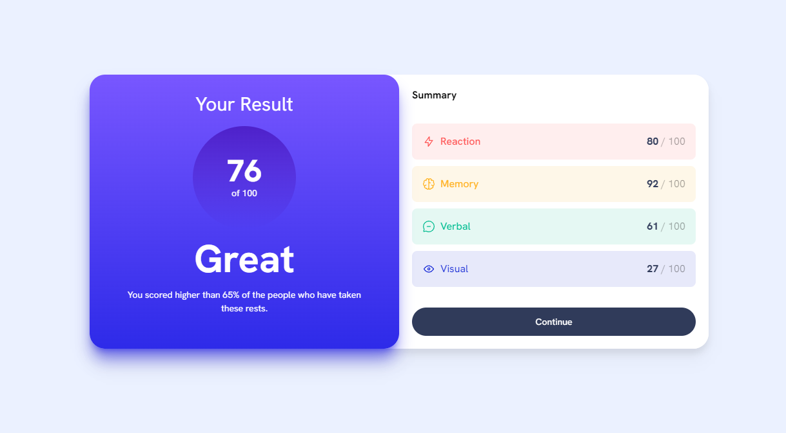

# Frontend Mentor - Results summary component solution

This is a solution to the [Results summary component challenge on Frontend Mentor](https://www.frontendmentor.io/challenges/results-summary-component-CE_K6s0maV). Frontend Mentor challenges help you improve your coding skills by building realistic projects.

## Table of contents

- [Overview](#overview)
  - [Screenshot](#screenshot)
  - [Links](#links)
- [My process](#my-process)
  - [Built with](#built-with)
  - [What I learned](#what-i-learned)
- [Author](#author)

**Note: Delete this note and update the table of contents based on what sections you keep.**

## Overview

### Screenshot



### Links

- Solution URL: [Solution](https://github.com/Mohamed-0Sabry/Results-summary-component)
- Live Site URL: [Site](https://mohamed-0sabry.github.io/Responsive-Results-summary-component/)

## My process

### Built with

- Semantic HTML5 markup
- CSS custom properties
- Flexbox
- Mobile-first workflow
- Tailwind CSS

### What I learned

This was my Second Project Using Tailwind, But I could say that I've learned alot , The fact That tailwind is bulit using Utility-First Structure is what makes it very customizable and simple, although the Calss names would be like this

```html
<main
  class="rounded-3xl drop-shadow-xl lg:w-1/2 bg-white flex flex-col lg:flex-row lg:relative lg:top-1/2 lg:left-1/2 lg:translate-y-1/2 lg:-translate-x-1/2"
>
  <section
    class="z-10 shadow-2xl lg:shadow-xl lg:shadow-[var(--gradient-lightRoyalBlue-lowerOpacity)] lg:hover:shadow-xl lg:hover:shadow-[var(--gradient-lightSlateBlue)] shadow-[var(--gradient-lightRoyalBlue-lowerOpacity)] rounded-xl lg:rounded-3xl flex-1 basis-1/2 left items-center py-7 px-12 text-white flex flex-col text-center gap-4"
  ></section>
</main>
```

But I actually got used to his View, Not quite XD

## Author

- LinkedIn - [Mohamed Sabry](https://www.linkedin.com/in/mohamed-sabry-eng/)
- Frontend Mentor - [@Mohamed-0Sabry](https://www.frontendmentor.io/profile/Mohamed-0Sabry)
